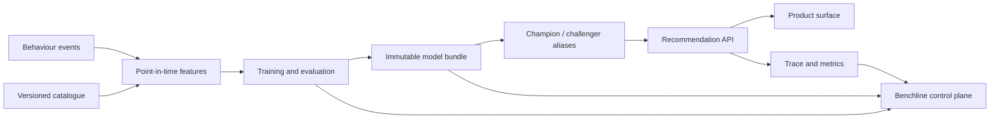

# Architecture

Benchline separates the recommendation data plane from the operator control plane while keeping both runnable in one repository.

## Runtime path

The current serving implementation resolves a user profile, blends content/collaborative and catalogue candidate signals, computes a bounded score, applies a creator-concentration penalty, and returns an evidence-bearing slate. The API validates inputs with Zod and returns a unique correlation ID for each request. Recommendation ordering remains deterministic for a fixed input.

The default catalogue and profiles are local fixtures. Their interfaces are deliberately small so a database, online feature store, vector index, or registry adapter can replace them without changing the web application’s public contract.

## Control path

Command Center joins current model, experiment, feature and delivery state. Explorer calls the real recommendation endpoint. Experiments, Registry, Feature Health and Delivery read the same typed workspace contract, preventing the common portfolio failure where attractive screens disagree about versions and metrics.

## Important boundaries

- `shared/` owns types that cross HTTP and UI boundaries.
- `server/recommender.ts` owns synchronous ranking behaviour and cannot depend on React.
- `ml/` owns reference evaluation and numerical definitions; the browser never recalculates authoritative metrics.
- `evidence/` contains generated results, not hand-edited claims.
- Release controls are demonstrative in v1; persistence and OIDC are production substitutions defined in the plan.

## Failure policy

The production design uses a fallback ladder: champion, previous champion, contextual popularity, then eligible global popularity. The demo’s local adapters are deterministic and always available, but the API shape carries degraded state and stage timing so failures can be introduced without a breaking change.
